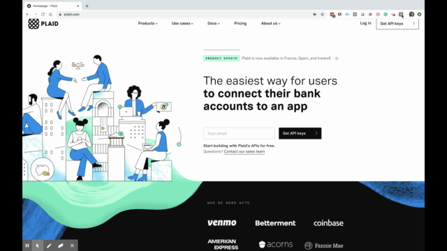

## Financial Web Extensions

Web extensions are really cool and often underrated in what they can do. With [Plaid](https://plaid.com/), web extensions can be taken to a whole new level!

This one is just a simple web extension that allows users to connect a financial institution and show real-time balances for accounts associated with the institution.

## Potential Applications

Plaid is putting Personal in "Personal Finance", allowing developers to build a slew of hyper personalized applications.

Although plaid offers a [full end-to-end example application](https://github.com/plaid/pattern), it's quite confusing for novice developers and requires a decent amount of setup. So feel free to clone this repo and extend the current functionality. Some potential extensions that would be useful are:

* An app that analyzes your income, spending history, and debt to determine if you can afford to buy/rent a home while browsing Zillow.
* An app that automatically writes your investment data to a Google Sheet
* An app that shows how much you've spent on clothes in the last month while internet shopping

## Getting Started

1. Clone the repo
2. Create an `.env` file that contains your plaid public key
3. Run `npm  build` or `yarn build`
4. Load the package into Google Chrome or Firefox or whatever browser you use (Chrome works best)
3. See `/server` for the basic server template  

